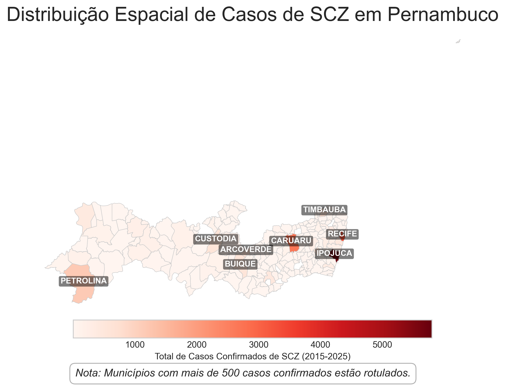
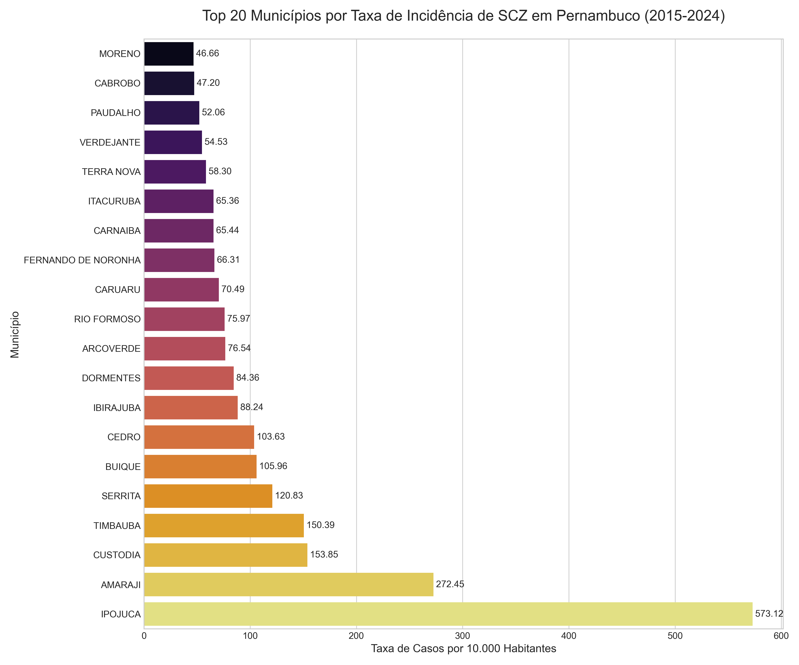
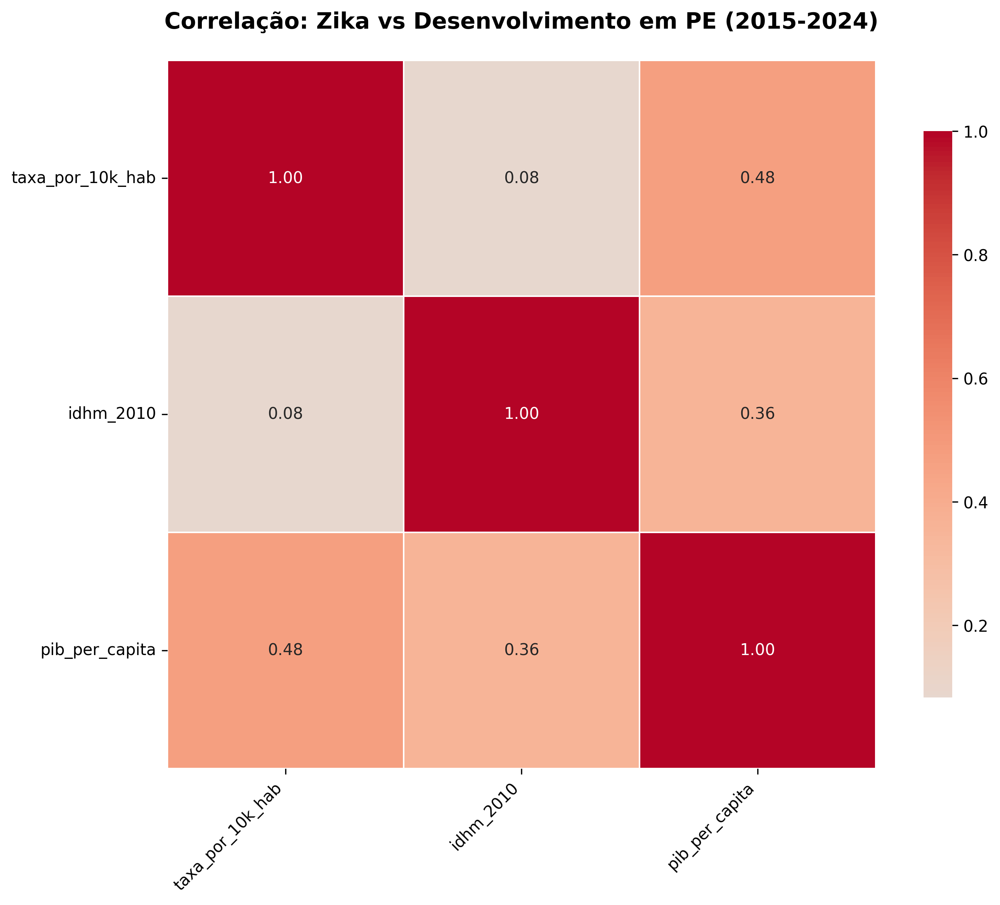

Projeto-IC: Análise da Epidemia de Zika/SCZ em PernambucoAnálise da correlação entre a taxa de incidência da Síndrome Congênita do Zika (SCZ) e indicadores socioeconômicos nos municípios de Pernambuco.

💡 A Hipótese CentralO objetivo deste projeto não foi apenas mapear a epidemia de Zika/SCZ, mas investigar sua relação com o contexto social. A hipótese era que a vulnerabilidade socioeconômica teria um papel fundamental na gravidade da epidemia em cada município.Principal Achado (Spoiler): A análise estatística confirma a hipótese. Indicadores como baixo IDHM e baixo PIB per capita apresentaram uma correlação negativa de moderada a forte com as taxas de incidência da doença. Em outras palavras, municípios com piores condições socioeconômicas foram, proporcionalmente, os mais afetados.📊 Painel de Resultados da AnáliseA investigação foi dividida em três etapas lógicas:1. 🗓️ O Panorama Temporal: Quando ocorreu o pico?A análise temporal dos casos confirmados de SCZ em Pernambuco mostra um pico epidêmico claro nos anos de 2015 e 2016, que serviram como foco principal do estudo.

2. 🗺️ O Panorama Espacial: Onde se concentraram os casos?O mapa de casos absolutos mostra uma concentração esperada na Região Metropolitana do Recife (RMR) e em polos regionais, que são áreas mais populosas.

3. ⚖️ A Análise de Incidência: Quem foi proporcionalmente mais afetado?Analisar números absolutos é enganoso. Ao calcular a taxa de incidência (casos por 100.000 habitantes), o cenário muda. Municípios menores e com menos recursos emergem como os mais severamente impactados, como mostra o Top 20.

4. 🔬 A Investigação Socioeconômica: Por quê?Esta é a etapa crucial. Cruzamos a taxa de incidência (Resultado 3) com indicadores sociais (IDHM e PIB) para testar a hipótese.Os gráficos de dispersão já sugerem uma tendência negativa clara: quanto piores os indicadores sociais (mais à esquerda no eixo X), mais altas as taxas de incidência (mais acima no eixo Y).Taxa de Incidência vs. IDHMTaxa de Incidência vs. PIB per capitaO heatmap de correlação estatística (Coeficiente de Pearson) confirma visualmente o que os gráficos de dispersão sugerem, provando a correlação negativa entre a incidência de SCZ e o desenvolvimento socioeconômico.

🚀 Como Replicar a Análise

Clique para expandir as instruções de instalação e execução
1. Pré-requisitosO projeto foi desenvolvido em Python 3.10+. Para instalar as dependências principais, execute:Bashpip install pandas geopandas matplotlib seaborn
2. Execução dos ScriptsOs scripts na pasta scripts/ devem ser executados em ordem, pois um depende dos dados gerados pelo anterior:Bash# 1. Carrega dados brutos, limpa e gera os gráficos/mapas iniciais
python scripts/01_coleta_dados.py

# 2. Usa dados de população para calcular taxas proporcionais e gera o Top 20
python scripts/02_calcular_taxas.py

# 3. Carrega dados socioeconômicos (IDHM, PIB) e gera os gráficos de correlação
python scripts/03_analise_correlacao.py

# 4. (Opcional) Script para gerar mapas interativos
python scripts/05_analise_interativa.py

📁 Estrutura do Projeto

Clique para expandir a estrutura de pastas
Projeto-IC/
│
├── 📄 README.md          # (Este arquivo)
│
├── 📂 dados/
│   ├── 📂 brutos/       # Dados originais (SINAN .csv, Shapefiles .shp, IBGE .csv)
│   └── 📂 processados/  # Arquivos intermediários (dados limpos, taxas calculadas)
│
├── 📂 resultados/
│   ├── 📂 graficos/     # Gráficos de barra, dispersão e heatmaps (.png)
│   └── 📂 mapas/        # Mapas coropléticos (.png)
│
└── 📂 scripts/
    ├── 🐍 01_coleta_dados.py       # Limpeza e Análise Temporal/Espacial
    ├── 🐍 02_calcular_taxas.py     # Cálculo de Incidência
    ├── 🐍 03_analise_correlacao.py # Correlação Socioeconômica
    └── 🐍 05_analise_interativa.py # (Bônus) Mapas interativos

📄 Relatório Acadêmico CompletoPara uma análise metodológica detalhada, discussão aprofundada dos resultados, limitações do estudo e conclusões, aceda ao relatório final do projeto:➡️ Download do Relatório Final em PDF(Substitua este link pelo caminho do seu PDF quando o tiver)
