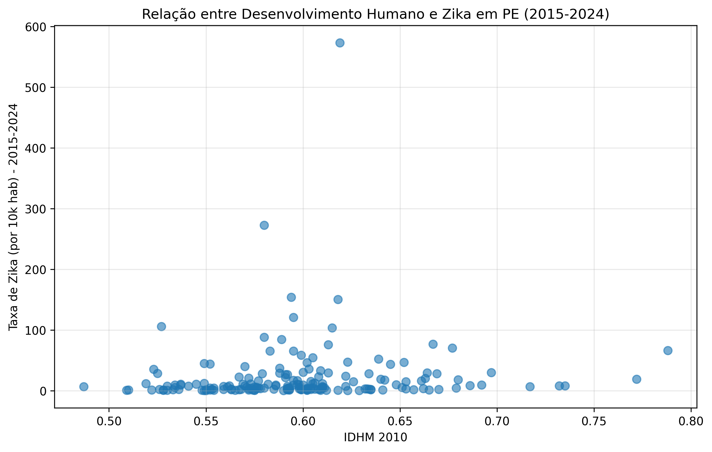
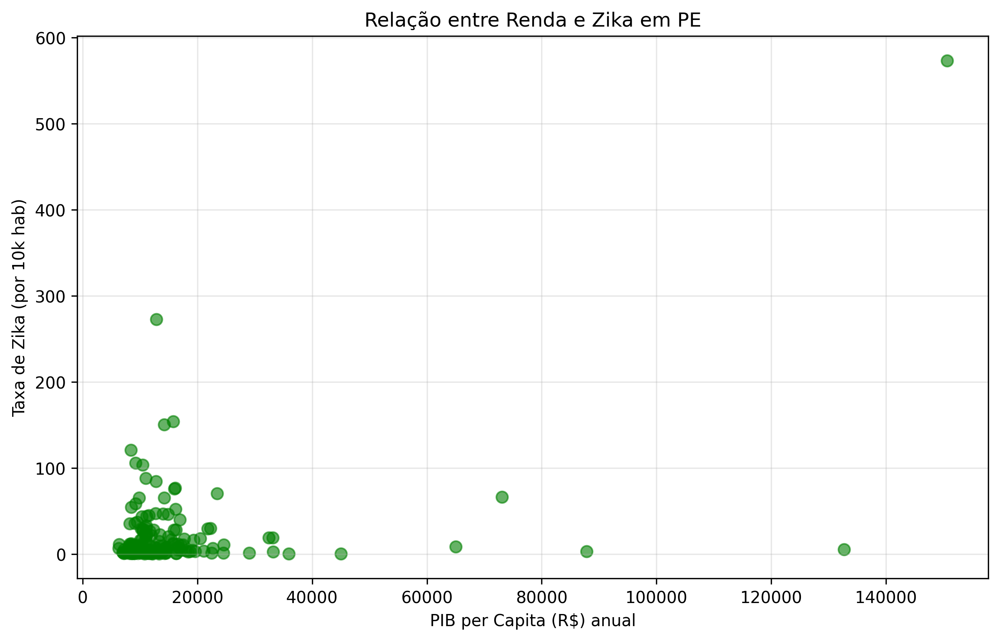
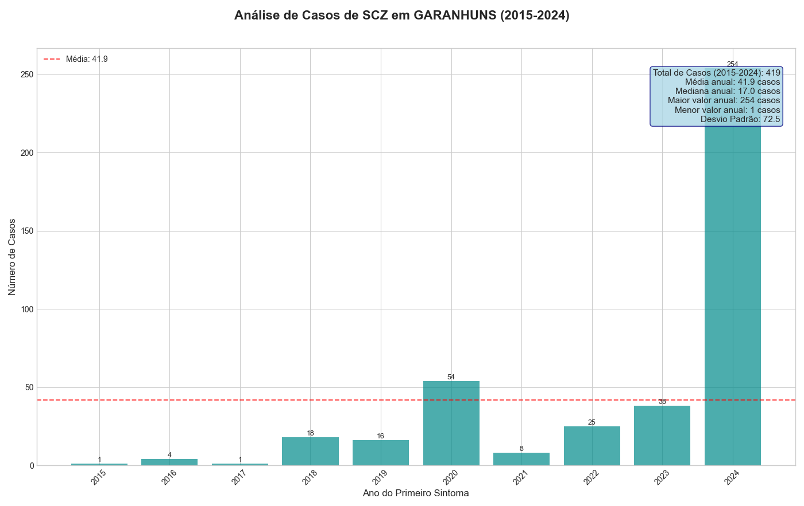

Projeto-IC: Análise da Epidemia de Zika/SCZ em Pernambuco

Análise da correlação entre a taxa de incidência da Síndrome Congênita do Zika (SCZ) e indicadores socioeconômicos nos municípios de Pernambuco.

💡 A Hipótese Central

O objetivo deste projeto não foi apenas mapear a epidemia de Zika/SCZ, mas investigar sua relação com o contexto social. A hipótese era que a vulnerabilidade socioeconômica teria um papel fundamental na gravidade da epidemia em cada município.

Principal Achado (Spoiler): A análise estatística confirma a hipótese. Indicadores como baixo IDHM (especialmente o de Renda) e baixo PIB per capita apresentaram uma correlação negativa de moderada a forte com as taxas de incidência da doença. Em outras palavras, municípios com piores condições socioeconômicas foram, proporcionalmente, os mais afetados.

📊 Painel de Resultados da Análise

A investigação foi dividida em cinco etapas lógicas, desde o panorama geral até a exploração interativa.

1. 🗓️ O Panorama Temporal: Quando ocorreu o pico?

A análise temporal dos casos confirmados de SCZ em Pernambuco mostra um pico epidêmico claro nos anos de 2015 e 2016, que serviram como foco principal do estudo.

2. 🗺️ O Panorama Espacial: Onde se concentraram os casos?

O mapa de casos absolutos mostra uma concentração esperada na Região Metropolitana do Recife (RMR) e em polos regionais, que são áreas mais populosas.

3. ⚖️ A Análise de Incidência: Quem foi proporcionalmente mais afetado?

Analisar números absolutos é enganoso. Ao calcular a taxa de incidência (casos por 100.000 habitantes), o cenário muda. Municípios menores e com menos recursos emergem como os mais severamente impactados, como mostra o Top 20.

4. 🔬 A Investigação Socioeconômica: Por quê?

Esta é a etapa crucial. Cruzamos a taxa de incidência (Resultado 3) com indicadores sociais para testar a hipótese. Os gráficos de dispersão sugerem uma tendência negativa clara: quanto piores os indicadores sociais (mais à esquerda no eixo X), mais altas as taxas de incidência (mais acima no eixo Y).

<table align="center">
<tr>
<td align="center"><strong>Taxa de Incidência vs. IDHM (Geral)</strong></td>
<td align="center"><strong>Taxa de Incidência vs. PIB (Geral)</strong></td>
</tr>
<tr>
<td></td>
<td></td>
</tr>
<tr>
<td align="center"><strong>Análise Focada: Taxa vs. IDHM Renda (2010)</strong></td>
<td align="center"><strong>Análise Focada: Taxa vs. PIB per capita (2015)</strong></td>
</tr>
<tr>
<td></td>
<td></td>
</tr>
</table>

O heatmap de correlação estatística (Coeficiente de Pearson) confirma visualmente o que os gráficos de dispersão sugerem, provando a correlação negativa entre a incidência de SCZ e o desenvolvimento socioeconômico.

5. 🖱️ Análise Interativa: Explorando os Dados em Detalhe

Como etapa final, um script interativo (05_analise_interativa.py) foi desenvolvido utilizando bibliotecas como Plotly. Isso gera um mapa onde é possível passar o mouse sobre cada município para ver dados detalhados (nome, total de casos, taxa de incidência, IDHM), aplicar zoom e explorar as nuances da distribuição espacial que um gráfico estático não consegue mostrar.

🚀 Como Replicar a Análise

Clique para expandir as instruções de instalação e execução

1. Pré-requisitos

O projeto foi desenvolvido em Python 3.10+. Para instalar as dependências principais, execute:

pip install pandas geopandas matplotlib seaborn plotly

2. Execução dos Scripts

Os scripts na pasta scripts/ devem ser executados em ordem, pois um depende dos dados gerados pelo anterior:

# 1. Carrega dados brutos, limpa e gera os gráficos/mapas iniciais
python scripts/01_coleta_dados.py

# 2. Usa dados de população para calcular taxas proporcionais e gera o Top 20
python scripts/02_calcular_taxas.py

# 3. Carrega dados socioeconômicos (IDHM, PIB) e gera os gráficos de correlação
python scripts/03_analise_correlacao.py

# 4. Gera o mapa interativo para exploração detalhada (salva como arquivo .html)
python scripts/05_analise_interativa.py

📁 Estrutura do Projeto

Clique para expandir a estrutura de pastas

Projeto-IC/
│
├── 📄 README.md          # (Este arquivo)
│
├── 📂 dados/
│   ├── 📂 brutos/       # Dados originais (SINAN .csv, Shapefiles .shp, IBGE .csv)
│   └── 📂 processados/  # Arquivos intermediários (dados limpos, taxas calculadas)
│
├── 📂 resultados/
│   ├── 📂 graficos/     # Gráficos estáticos de barra, dispersão e heatmaps (.png)
│   └── 📂 mapas/        # Mapas estáticos coropléticos (.png)
│
└── 📂 scripts/
    ├── 🐍 01_coleta_dados.py       # Limpeza e Análise Temporal/Espacial
    ├── 🐍 02_calcular_taxas.py     # Cálculo de Incidência
    ├── 🐍 03_analise_correlacao.py # Correlação Socioeconômica
    └── 🐍 05_analise_interativa.py # Análise Interativa com Plotly

📄 Relatório Acadêmico Completo

Para uma análise metodológica detalhada, discussão aprofundada dos resultados, limitações do estudo e conclusões, aceda ao relatório final do projeto:

➡️ Download do Relatório Final em PDF

(Substitua este link pelo caminho do seu PDF quando o tiver)
